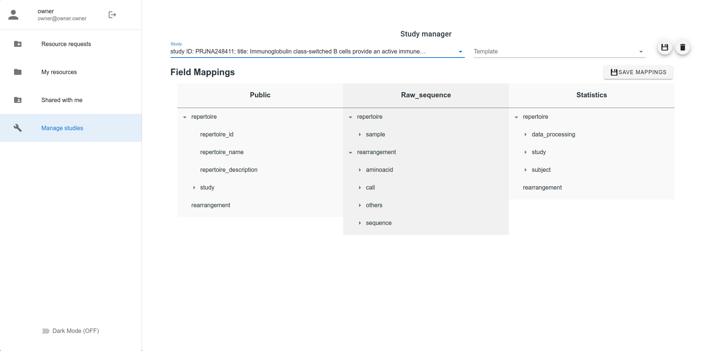

# acl-dashboard

Access control dashboard for interactive management of user-based permissions of AIRR repositories protected by the [adc-middleware](https://github.com/ireceptorplus-inesctec/adc-middleware)

The access is managed via a set of authorization profiles (*public*, *statistics* and *raw_sequence*), refered as scoped throughout the document

Project runs on **Vue.js** using **keycloak-js** library to manage the authentication compatibility with the *middleware*

This project also uses the following main libraries: **axios**, **vue-router**, **vuedraggable**, **vuetify** and **vuex**

## Running with Docker

A Docker image is available at DockerHub: https://hub.docker.com/r/irpinesctec/acl-dashboard

The `docker-compose.yml` file contains an example of which environment parameters need to be set.

By default the service runs on **port 80**.

## Running Natively

```bash
# clone the project
git clone https://github.com/ireceptorplus-inesctec/acl-dashboard

# enter the project directory
cd acl-dashboard

# install dependencies
npm install
```

### Run in development mode

```bash
# edit environment variables
nano .env
OR
nano .env.local

# run project in development mode
npm run serve
```

### Build and minify for production

```bash
# edit environment variables
nano .env
OR
nano .env.production

# build project
npm run build
```

Note the *.env.local* and *.env.production* override *.env*

## Environment variables (default)
- PUBLIC_PATH: Defines the base path for the application.
- VUE_APP_KEYCLOAK_URL: Keycloak's base URL (http://localhost:8082/auth/)
- VUE_APP_KEYCLOAK_REALM: Keycloak's realm (master)
- VUE_APP_KEYCLOAK_CLIENT_ID: Keycloak's dashboard client id (acl-dashboard)
- VUE_APP_MIDDLEWARE_URL: ADC Middleware's base URL (http://localhost:8080/)

## Features

- Owners
  - List pending requests
    - Accept/Deny pending requests
  - List owned resources
    - List users and scopes resource is shared with
    - Revoke access from another user to owner's resource
  - Share (specific scope from a) resource with another user
  - Transfer resource ownership to another user
  - Update field mappings for each study
    - Create/Delete/Use templates

- All users
  - List resources shared with them

## Features (description)

- **Owners**
  - **List pending requests** - an owner can see a list of the pending requests sent by users to any of his owned resources
    - **Accept/Deny pending requests** - an owner can accept or deny any of the user made requests, granting access to a specific scope of a resource or denying it
  - **List owned resources** - an owner can list all the resources he owns together with the available access scopes for that resource
    - **List users and scopes resource is shared with** - an owner can access his resources details, listing all the users the resource is shared with and the corresponding scopes
    - **Revoke access from another user to owner resource** - an owner can revoke another user's access to his resources, clearing all the granted access scopes
  - **Share (specific scope from a) resource with another user** - an owner can share a resource with any user via username or email, selecting the wanted access scopes
  - **Transfer resource ownership to another user** - an owner can revoke the ownership of a resource by sharing it with any user via username or email, making the new user the new owner of the resource
  - **Update field mappings for each study** - an owner can configure which study fields are shared with each scope, customizing how the study is shared with the remaining users
    - **Create/Delete/Use templates** - an owner can utilize templates to avoid recreating and reutilizes field mapping schemes, being able to create and delete them as well

- **All users**
  - **List resources shared with them** - a user can list all the resources that are shared with him, viewing the access scopes he was granted for each resource

## Pages

- **Resource requests**
  - As a resource owner you can see a page with every request sent to you, requesting access to your studies. In this page each request identifies the study and the requested scope (if you have been requested 3 scopes for the same study, 3 requests will appear) and you can either accept or deny them


- **My Resources**
  - As a resource owner you can see a page with every study you own and the scopes associated with each study. When you open a study, you can see more information on the study and you can perform actions on it:
    - You can share specific scopes with another user, either using his username or email
    - You can transfer the ownership of the study to another user, either using his username or email
    - You can see a list of all the users that study is currently being shared with
    - You can revoke any user's access to your study in the mentioned list


- **Shared with me**
  - As a user you can see a page with every study shared with you, with an entry for each scope you have access. The owner of each study is also represented on each entry, making it easy to search for a specific resource.


- **Manage Studies**
  - In this page you will first be prompted to select one of the studies you own on a drop-down tab. After selecting the study, a tree-like grid will appear for each scope, this grid represents how the study fields are mapped to each scope. As a resource owner you can drag any field (parent, leaf, whole tree) and customize its level of security or how it is shared, making each field accessible with the permission you feel adequate.




## Browsers support

Modern browsers

| [](http://godban.github.io/browsers-support-badges/)<br/>Edge | [](http://godban.github.io/browsers-support-badges/)<br/>Firefox | [](http://godban.github.io/browsers-support-badges/)<br/>Chrome | [](http://godban.github.io/browsers-support-badges/)<br/>Safari |
| --------- | --------- | --------- | --------- |
| Edge| last 2 versions| last 2 versions| last 2 versions
